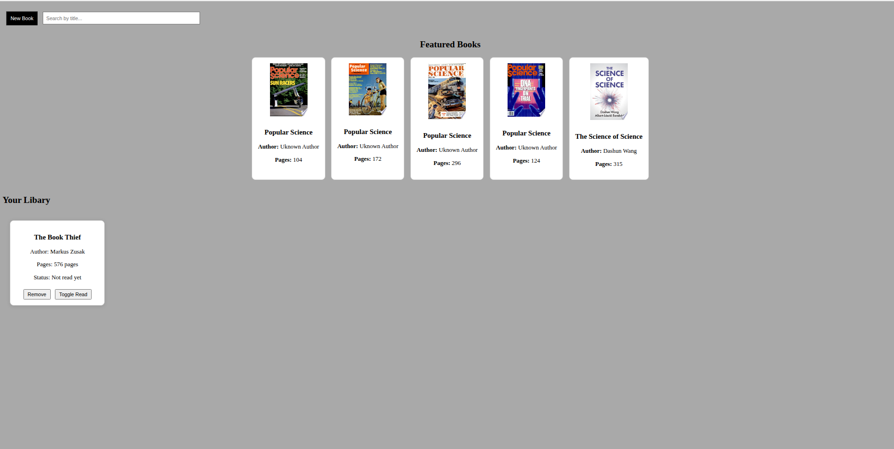

# libary
**This project was built as part of the [JavaScript Library Project from The Odin Project](https://www.theodinproject.com/lessons/node-path-javascript-library).**

In this project I created a small libary app, that lets users adds books via a form with options to remove or togge read status.You can search you're inventoy too when adding books. Also when the page is displayed is showcases 5 different featured book from different categories from's google api [Google Books API](https://developers.google.com/books)

